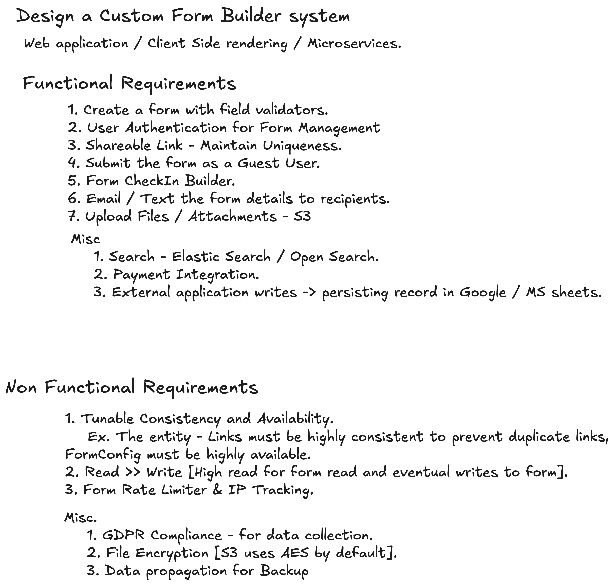
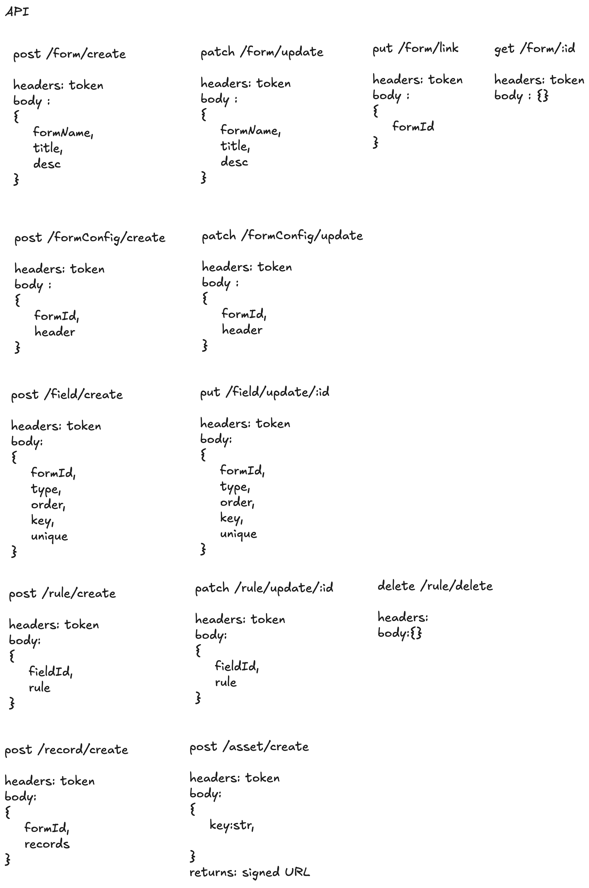
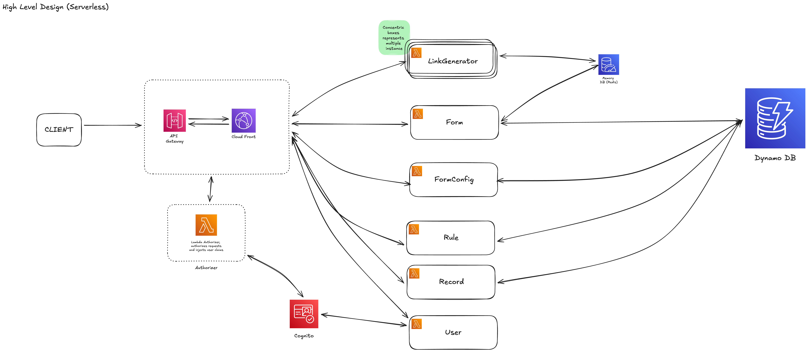
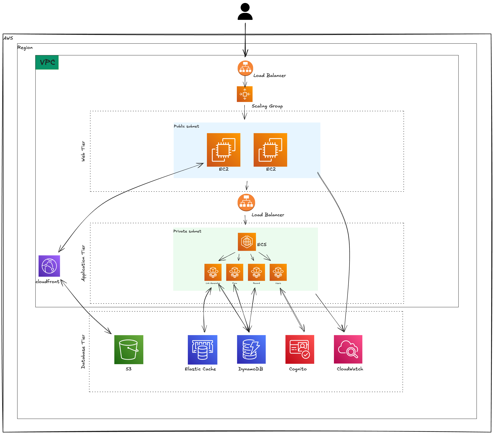

# FormBuilder

FormBuilder is a powerful, intuitive tool that allows users to create custom forms with ease. From simple contact forms
to complex multi-step workflows, FormBuilder provides a drag-and-drop interface, dynamic fields, conditional logic, and
real-time validation.

---

# Project Structure

```
formbuilder/
├── frontend/
│   ├── src/
│   │   ├── components/
│   │   ├── pages/
│   │   ├── services/
│   │   ├── favicon.ico
│   │   ├── index.html
│   │   ├── main.ts
│   │   ├── styles.css
│   ├── public/
│   └── package.json
├── backend/
│   ├── modules/
│   │   ├── lambda/
│   │   ├── fargate/
│   │   ├── ec2/
│   │   │── alb/
│   │   │── dyanamodb/
│   │   │── cognito/
│   │   │── redis/
│   ├── main.tf
└── README.md
```

---

# System Design

---

## Overview

Design a Custom Form Builder system as a web application with client-side rendering and microservices architecture.

## Functional and Non Functional Requirements



## Core Entities and API

### Entity Diagram (UML)

#### User

- `name`: str
- `id`: uuid (PK)
- `email`: str

#### Password

- `userId`: str (FK)
- `id`: uuid (PK)
- `password`: str (hash - MD5)

#### Form

- `id`: uuid (PK)
- `formName`: str (32)
- `title`: str
- `desc`: str (256)
- `userId`: uuid
- `createdAt`: date
- `updatedAt`: date

#### FormConfig

- `id`: uuid (PK)
- `formId`: uuid (FK)
- `header`: uuid (Asset - FK)

#### Field

- `id`: uuid (PK)
- `formId`: uuid (FK)
- `type`: enum [FieldType]
- `order`: num
- `key`: str
- `unique`: boolean

#### FieldType Enum

- INPUT
- CHECKBOX
- RADIO_BUTTON
- SELECT

#### Rule

- `id`: uuid (PK)
- `fieldId`: uuid (FK)
- `rule`: str

#### Records

- `id`: uuid (PK)
- `formId`: uuid (FK)
- `record`: JSONString

#### Asset

- `id`: uuid (PK)
- `key`: str
- `prefix`: str
- `bucket`: str
- `region`: str

### Example API



## Design Resources

- **Interactive Design Diagram**: [View on Excalidraw](https://excalidraw.com/#json=a7YHcXw_g_N8_oQATtzhm,eAb2OByf5TgkTb2Pw0hJbw)
  - This Excalidraw diagram contains the complete system design, entity relationships, and architecture diagrams.

## High Level Design

### Serverless / Fully Microservice Architecture



### Hybrid - (Monolithic + Microservice)




## Getting Started

---

### Frontend Setup

```bash
cd frontend
npm install
npm start  # Runs on http://localhost:4200
```

### Running Tests

```bash
npm test   # Unit tests with Karma
```

### Build for Production

```bash
npm run build  # Creates optimized build in dist/
```

---

## Contributing

Please follow the established code style and commit message conventions. All pull requests must include tests and documentation updates.

---

## Resources

- [Angular Documentation](https://angular.dev)
- [TypeScript Documentation](https://www.typescriptlang.org/docs/)
- [Terraform Documentation](https://www.terraform.io/docs)
- [AWS Documentation](https://docs.aws.amazon.com/)
- [Design Diagrams](https://excalidraw.com/#json=a7YHcXw_g_N8_oQATtzhm,eAb2OByf5TgkTb2Pw0hJbw)


